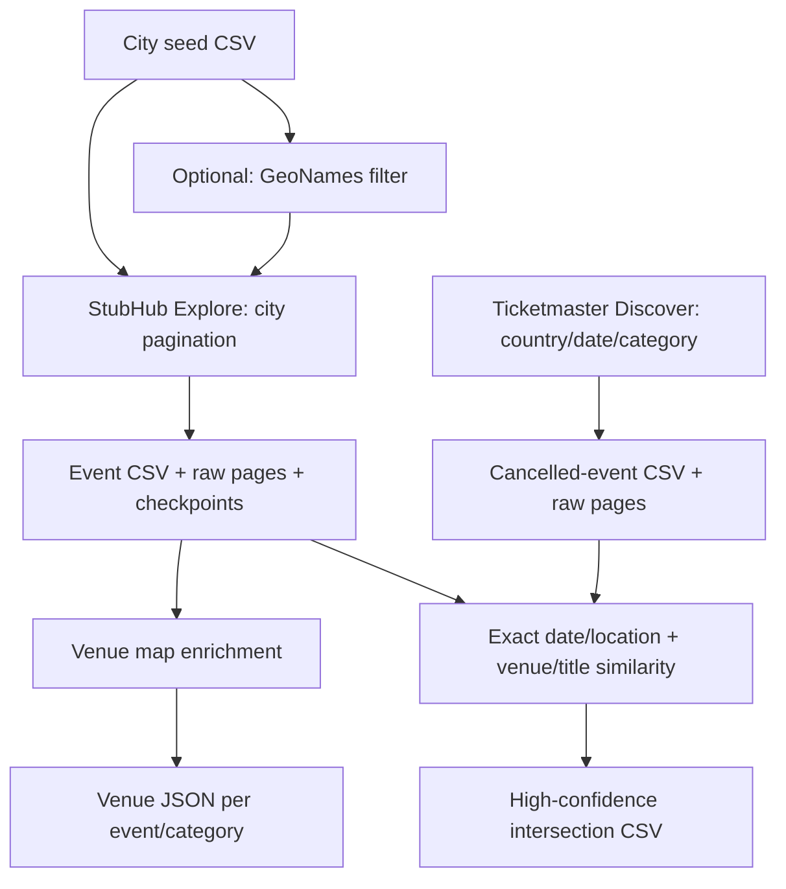

# StubHub All Event Scraper

Five CLI tools collect location-based StubHub events, enrich venue maps, collect
Ticketmaster cancellations and match the two datasets. This is a discovery and
record-linkage pipeline: it cannot guarantee every event or confirm live ticket
inventory. The bundled seed list currently covers the US and Canada.

Python 3.11+ and `curl` are required. Runtime Python dependencies: none.

## Flow



## Install and run

From a checkout of this repository:

```bash
python3 -m venv .venv
source .venv/bin/activate
python -m pip install -e .

stubhub-scrape-events
stubhub-fetch-venues

ticketmaster-scrape-cancelled-events
stubhub-find-cancelled-overlap
```

Optional city filtering:

```bash
stubhub-filter-cities
stubhub-scrape-events --input-csv data/worldcities.filtered.csv
```

All five commands support `--help`. Run them from the checkout root, or override
the default relative paths. Installing the Python package does not install the
city dataset.

## Configuration and outputs

Settings come from the process environment; `.env` is **not loaded automatically**.
To use the supplied shell-compatible template:

```bash
cp .env.example .env
# Edit .env, then export it into the current shell:
set -a
source .env
set +a
```

See [.env.example](.env.example) for the supported settings. Defaults:

| Data | Location |
| --- | --- |
| City seeds | `data/worldcities.csv` |
| StubHub events / raw pages | `output/events.csv` / `output/wget_output/` |
| Resume checkpoints | `log/progress_log_event.log` |
| Venue maps | `output/venues/<eventId>_<categoryId>_venue.json` |
| Ticketmaster cancellations / raw pages | `output/ticketmaster_cancelled_events.csv` / `output/ticketmaster_cancelled_events/` |
| Matched events | `output/stubhub_ticketmaster_cancelled_intersection.csv` |

StubHub resumes the same crawl. Use fresh event and checkpoint paths for a new
snapshot; see [components](docs/components.md). City pagination stops at 100
pages or heavy overlap, so results can be partial. Ticketmaster rejects missing
pages and unstable totals; its optional debug page cap explicitly permits a
partial snapshot. Website endpoints can change without notice.

Only run one process per output/checkpoint set. `WAIT_SECONDS` paces each StubHub
worker, not the entire pool; concurrency multiplies the overall request rate.
Ticketmaster requests are serial and default to a two-second interval.

## Structure and development

```text
src/stubhub_all_event_scraper/   Five commands + config, HTTP and runtime helpers
scripts/                       Optional official Ticketmaster API access check
tests/                        Offline regression tests
data/                         Versioned city seeds; generated filters ignored
docs/                         Concise component, matching and audit notes
log/, output/                 Ignored local run artifacts
```

```bash
python -m pip install -e '.[dev]'
python -m unittest discover -s tests
python -m ruff check .
python -m ruff format --check .
python -m build
```

Development tools are Ruff and the package builder; tests use `unittest`.
CI runs checks on Python 3.11, 3.13 and 3.14. See
[component contracts](docs/components.md), [matching](docs/cancelled_event_intersection.md),
[Ticketmaster collection](docs/ticketmaster_cancelled_events.md),
[optional API verification](docs/ticketmaster_api_verification.md) and
[review notes](docs/repository_review.md).

MIT license; see [LICENSE](LICENSE).
