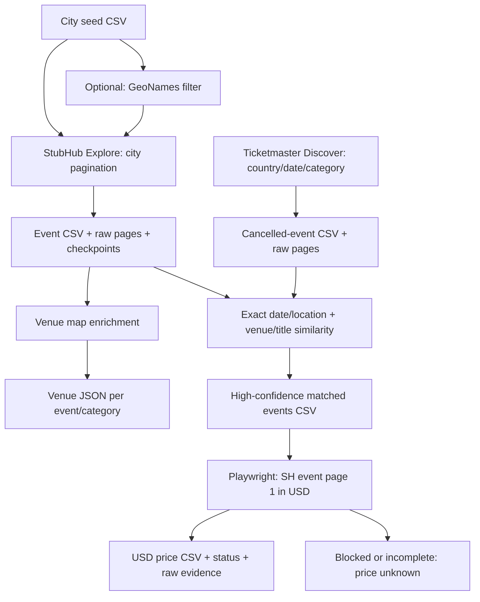

# Cancelled Event

Cancelled Event collects Ticketmaster cancellations and StubHub events, matches
the two snapshots and verifies current StubHub listing prices in USD. Optional
commands filter city seeds, enrich venue maps and check official API access.
This is a discovery and record-linkage pipeline: it cannot guarantee every event or confirm live ticket
inventory. The bundled seed list currently covers the US and Canada.

Python 3.11+ and `curl` are required. Browser price collection also requires
the optional Playwright dependency and Chromium; the other commands use the standard library.

## Flow



## Install and run

From a checkout of this repository:

```bash
python3 -m venv .venv
source .venv/bin/activate
python -m pip install -e '.[browser]'
python -m playwright install chromium

cancelled-event collect stubhub
cancelled-event venues

cancelled-event collect ticketmaster
cancelled-event run --output-dir output/cancelled/new-run
```

The workflow uses the two collected CSVs, then matches cancellations and fetches
prices into a fresh directory. It preserves source snapshots and links. The
individual `cancelled-event match` and `cancelled-event prices` commands
remain available. The default price source warms an anonymous browser session,
then reads actual listings embedded in each event's first HTML page. This path
explicitly requests `currency=USD` and checks that the response uses USD, so
browser prices need no local currency conversion. The browser path
has returned real prices for cancelled Chad Gray and an active basketball
control. See [price refresh](docs/price_refresh.md) for coverage and currency rules.

Optional city filtering:

```bash
cancelled-event filter-cities
cancelled-event collect stubhub --input-csv data/worldcities.filtered.csv
```

Run `cancelled-event --help` for the command list. Every subcommand supports
`--help`; `python -m cancelled_event` provides the same interface. Run commands
from the checkout root, or override the default relative paths. Installing the Python package does not install the
city dataset.

## Configuration and outputs

Settings come from the process environment; `.env` is **not loaded automatically**.
To use the supplied shell-compatible template:

```bash
cp .env.example .env
# Edit .env, then export it into the current shell:
set -a
source .env
set +a
```

See [.env.example](.env.example) for the supported settings. Defaults:

| Data | Location |
| --- | --- |
| City seeds | `data/worldcities.csv` |
| StubHub events / raw pages | `output/events.csv` / `output/wget_output/` |
| Resume checkpoints | `log/progress_log_event.log` |
| Venue maps | `output/venues/<eventId>_<categoryId>_venue.json` |
| Ticketmaster cancellations / raw pages | `output/ticketmaster_cancelled_events.csv` / `output/ticketmaster_cancelled_events/` |
| Matched events | `output/matches.csv` |
| Refreshed prices / evidence | `output/prices/enriched.csv` / `output/prices/checks.json` and `raw/` |
| Combined match/price workflow | `output/cancelled-workflow/matches.csv`, `prices/`, `manifest.json` |

StubHub resumes the same crawl. Use fresh event and checkpoint paths for a new
snapshot; see [components](docs/components.md). City pagination stops at 100
pages or heavy overlap, so results can be partial. Ticketmaster rejects missing
pages and unstable totals; its optional debug page cap explicitly permits a
partial snapshot. Website endpoints can change without notice.

Only run one process per output/checkpoint set. `WAIT_SECONDS` paces each StubHub
worker, not the entire pool; concurrency multiplies the overall request rate.
Ticketmaster requests are serial and default to a two-second interval.
Price requests also run serially at a two-second interval. Use a fresh price
output directory each run. Blank prices mean unknown. An explicit empty listing
grid is marked `no_listings`; HTTP errors never establish zero inventory. The
default `--source event-page` reads one page per event. A minimum that cannot be
confirmed against the event minimum is marked `page_priced` with page-only scope.
The optional `--source explore` uses displayed from-prices rather than listing floors.

## Structure and development

```text
src/cancelled_event/
  cli.py, __main__.py          Unified command and python -m entry point
  matching.py, workflow.py     Matching and combined match/price workflow
  sources/                    StubHub, Ticketmaster, venue maps and city seeds
  pricing/                    Price orchestration, adapters and shared parsing
  diagnostics/                Official Ticketmaster API access check
  config.py, http.py, runtime.py
                              Validated settings, transport and publication
tests/                       Offline regression tests and captured fixtures
data/                        Versioned city seeds; generated filters ignored
docs/                        Component, matching and price coverage notes
.github/workflows/           CI checks
log/, output/                Ignored local run artifacts
```

```bash
python -m pip install -e '.[dev]'
python -m unittest discover -s tests
python -m ruff check .
python -m ruff format --check .
python -m build
```

Development tools are Ruff and the package builder; tests use `unittest`.
CI runs checks on Python 3.11, 3.13 and 3.14. See
[component contracts](docs/components.md), [matching](docs/matching.md),
[Ticketmaster collection](docs/ticketmaster_cancellations.md),
[price refresh](docs/price_refresh.md),
[optional API verification](docs/ticketmaster_api.md) and
[review notes](docs/repository_review.md).

Derived from [Praburam’s StubHub All Event Scraper](https://github.com/praburamWAPKA/stubhub_all_event_scraper).
Maintained as an independent project. Original copyright and MIT terms are
preserved; see [LICENSE](LICENSE).
